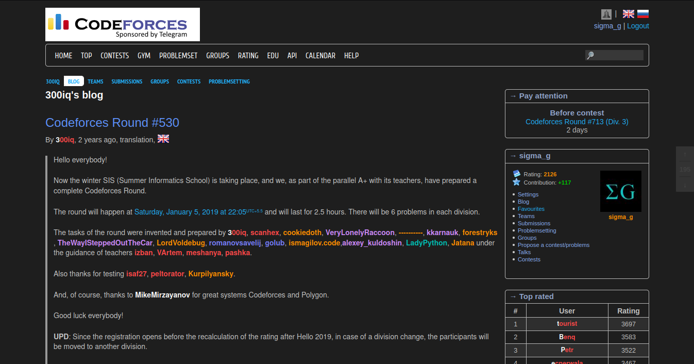

# Codeforces Dark Theme - KR

한국어 번역이 포함된 코드포스 다크 테마입니다. [**Click to install**](https://raw.githubusercontent.com/groun519/codeforces-darktheme-korean/main/codeforces-korean-darktheme.user.js) (Tampermonkey 사용자 스크립트 매니저 필요)

이 프로젝트는 [GaurangTandon/codeforces-darktheme](https://github.com/GaurangTandon/codeforces-darktheme)를 기반으로 하여,  
한국어 사용자에 맞게 UI 텍스트를 번역하고 스타일을 개선한 확장 프로젝트입니다.

**접근성 고려**: 사용된 모든 색상은 최소 AA 접근성 대비율 4.5:1을 만족하며, 대부분은 AAA 대비율 7:1도 충족합니다.

## 설치 방법

1. 브라우저에 Tampermonkey를 설치하세요. ([설치 안내](https://tampermonkey.net/))
2. [**이 링크를 클릭**](https://raw.githubusercontent.com/groun519/codeforces-darktheme-korean/main/codeforces-korean-darktheme.user.js)하여 Codeforces 다크 테마 사용자 스크립트를 설치하세요.

스크립트가 나중에 업데이트되더라도 페이지를 다시 방문할 필요는 없습니다.  
Tampermonkey는 기본적으로 24시간마다 새로운 업데이트를 자동으로 가져옵니다.

만약 아래와 같은 경고가 나타난다면:

> 이 웹사이트에서는 앱, 확장 프로그램, 사용자 스크립트를 추가할 수 없습니다.

이 경고는 취약한 사용자가 악성 확장 프로그램과 앱을 설치하는 것을 방지하기 위한 것입니다.  
이 사용자 스크립트는 GitHub에 공개되어 있으므로 신뢰할 수 있습니다. 따라서 경고를 무시하고 설치를 진행해도 됩니다.

## 참고 사항

1. **등급 색상 조정**: 최신 다크 테마에 어울리도록 사용자 핸들 색상을 재작업했습니다.  
   즉, 다음 색상들이 이전과 약간 다르게 보이지만, 눈썰미가 좋으신 분들은 눈치채셨을 겁니다.  
   이러한 색상 조정은 어두운 배경에서 텍스트의 명암비를 개선하기 위한 것입니다.

    | 사용자 등급                                        | 원래 색상                                                            |                             새로운 색상                              |
    | -------------------------------------------- | ------------------------------------------------------------------------- | :----------------------------------------------------------------: |
    | admins, non-rated, first letter of legendary | black (`#000`)                                                            |                           white (`#fff`)                           |
    | Grandmaster                                  |  red                  |  `#ff4747` |
    | Candidate master                             |  violet            |  `#ce8aff` |
    | Expert                                       |  blue                |  `#757dff` |
    | Specialist                                   |  cyan (`#03a89e`)    |  `#01bdb2` |
    | Pupil                                        |  green (`#00d700`) |  `#00c700` |
    | Newbie                                       |  gray                |  `#8c8c8c` |

    모든 색상 변화를 한 번에 보려면 블로그 게시물 ["색상과 제목의 두 번째 혁명"](https://codeforces.com/blog/entry/20638)에 있는 표를 참고하세요.

## 외부 종속성

모두 다크 테마 코드 구문 강조를 위한 것입니다.

1. [prettyprint의 desert.css](https://github.com/google/code-prettify/blob/master/styles/desert.css):  
   Codeforces는 제출물의 표시 형식을 지정하기 위해 동일한 라이브러리에 의존합니다. (Apache 라이선스)

2. [Ace editor의 monokai.css](https://github.com/ajaxorg/ace/blob/master/lib/ace/theme/monokai.css):  
   Codeforces의 제출 코드박스에서 사용됩니다. (BSD 라이선스)

## 기여 지침

PR은 언제나 환영합니다!  
하지만 PR이 해결하려는 문제를 설명하는 이슈를 먼저 생성한 후, 그 이슈를 다시 생성하는 것이 문제에 대한 더 다양한 의견을 얻는 데 더 나을 수 있습니다.

## 라이선스

MIT 라이선스가 적용되어 있습니다.  
이 프로젝트는 원본 프로젝트 [GaurangTandon/codeforces-darktheme](https://github.com/GaurangTandon/codeforces-darktheme)의 MIT 라이선스를 계승하며, 수정 및 재배포가 자유롭습니다.
